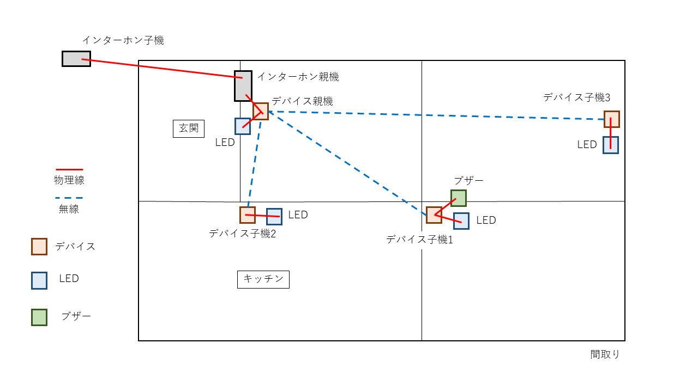

# ding_dong_flash

## 概要

インターホンの音が聞こえない人向けに、来客を光で報告。  
本親デバイスを、インターホン親機に接続し、来客情報を離れた場所にある子デバイスに送信する。  
来客情報を受信した子デバイスは、ハイパワーLEDを点滅させ、来客を知らせる。  
商品名は「ピンポンフラッシュ」、ピンポンダッシュをもじった。  
 

## ネットワーク構成

|名称|ipアドレス|
|:---:|:---:|
|サブネットマスク|255.255.255.248|

|ipアドレス|機種|参考|
|:---:|:---:|:---:|
|192.168.1.0|-|ネットワークアドレス|
|192.168.1.1|親機|インターホン親機に接続|
|192.168.1.2|子機1|ベルが外付けされている子機|
|192.168.1.3|子機2| |
|192.168.1.4|子機3| |
|192.168.1.5|-(空き)| |
|192.168.1.6|-(空き)| |
|192.168.1.7|-|ブロードキャストアドレス|

## サービスモデル

以下のように、デバイスを配置する。  

## システムモデル

インターホン親機は、インターホン子機押下時に反応する、A接点が搭載されている。  
デバイス親機は、インターホン子機が押下されたことを検出した場合、接続されているLEDに対し、点灯処理を行う。  
また、デバイス子機に、点灯リクエストを送信する。  

デバイス子機は、点灯リクエストを受け取った場合、デバイス親機にACKを返す。  
また、接続されているLEDに対し、点灯処理を行う。  
デバイス子機1に関しては、接続されているブザーに対し、鳴動処理も行う。  

  

## 回路図

使用する電子部品および、回路図は以下の通り。  
図を掲載 