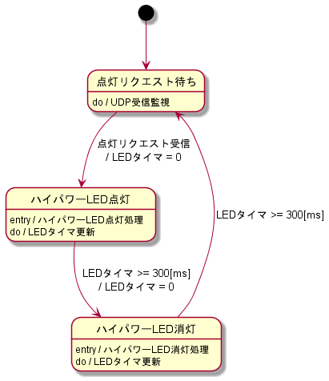

# ding_dong_flash

## 概要

インターホンの音が聞こえない人向けに、来客を光で報告。  
本親デバイスを、インターホン親機に接続し、離れた場所にある子デバイスに来客情報を送信する。  
来客情報を受信した子デバイスは、ハイパワーLEDを点滅させ、来客を知らせる。  
商品名は「ピンポンフラッシュ」、ピンポンダッシュをもじった。  

## ネットワーク構成

| 名称             | ipアドレス      |
| :--------------: | :-------------: |
| サブネットマスク | 255.255.255.248 |

| ipアドレス  | 機種    | 参考                       |
| :---------: | :-----: | :------------------------: |
| 192.168.1.0 | -       | ネットワークアドレス       |
| 192.168.1.1 | 親機    | インターホン親機に接続     |
| 192.168.1.2 | 子機1   | ベルが外付けされている子機 |
| 192.168.1.3 | 子機2   |                            |
| 192.168.1.4 | 子機3   |                            |
| 192.168.1.5 | -(空き) |                            |
| 192.168.1.6 | -(空き) |                            |
| 192.168.1.7 | -       | ブロードキャストアドレス   |

## サービスモデル

以下のように、デバイスを配置する。  

## システムモデル

インターホン親機は、インターホン子機押下時に反応する、A接点が搭載されている。  
デバイス親機は、インターホン子機が押下されたことを検出した場合、接続されているLEDに対し、点灯処理を行う。  
また、デバイス子機に、点灯リクエストを送信する。  

デバイス子機は、点灯リクエストを受け取った場合、接続されているLEDに対し、点灯処理を行う。  
デバイス子機1に関しては、接続されているブザーに対し、鳴動処理も行う。  

  

点灯リクエストのipアドレス/ポート番号の関係は以下の通り。  
(デバイス親機 -> デバイス子機への通信)  

| 送信元ip    | 送信元ポート | 宛先ip      | 宛先ポート |
| :---------: | :----------: | :---------: | :--------: |
| 192.168.1.1 | 8080         | 192.168.1.2 | 8081       |
| 192.168.1.1 | 8081         | 192.168.1.3 | 8081       |
| 192.168.1.1 | 8082         | 192.168.1.4 | 8081       |

## 状態遷移図

デバイス親機  

デバイス子機  

## 回路図

使用する電子部品および、回路図は以下の通り。  
※ピン番号は、電子部品のデータシート参照。  
  

電源は12V1Aを使用する。  
図中の①〜③は、デバイスによって実装を変更する。  
組み合わせは以下の通り。  

| デバイス名 | 組み合わせ |
| :--------: | :--------: |
| 親機       | ①, ③     |
| 子機1      | ②, ③     |
| 子機2      | ③         |
| 子機3      | ③         | 
